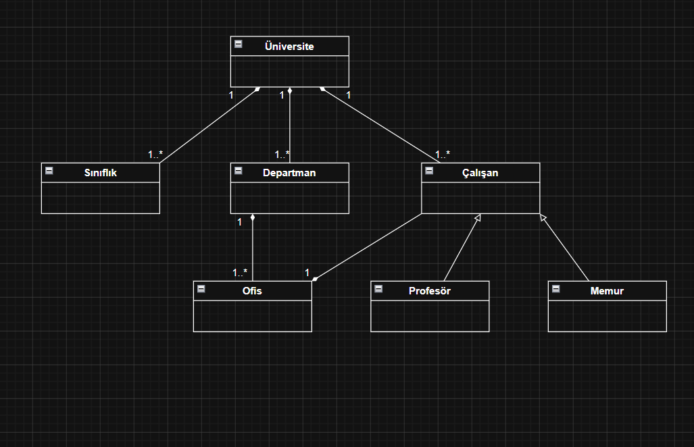

# Üniversite Yönetim Sistemi - Sınıf Diyagramı

Bu ödevde, bir üniversite yapısını temsil eden nesne yönelimli bir sistemin sınıf (class) diyagramı tasarlanmıştır.

## Ödev İçeriği

Aşağıdaki kurallara uygun bir sınıf diyagramı çizilmesi istenmiştir:

1. Üniversiteye ait sınıflıklar, çalışma ofisleri ve departmanlar vardır.
2. Departmanlara ait ofisler vardır.
3. Üniversiteye ait çalışanlar vardır. Bu çalışanlar profesör veya memur olabilir.
4. Her çalışan bir ofiste çalışır.

## Sınıf Diyagramı

