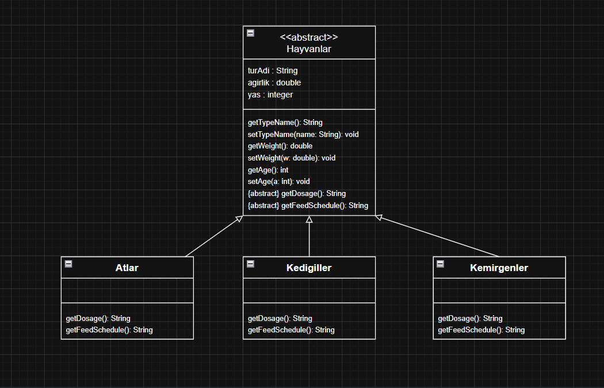

# Hayvanat Bahçesi Yönetim Sistemi - Polimorfizm Diyagramı

Bu ödevde, bir hayvanat bahçesindeki hayvanların bilgilerini ve bakım süreçlerini takip eden, polimorfizm (çok biçimlilik) prensibini temel alan bir sınıf diyagramı tasarlanmıştır.

## Ödev İçeriği

Sistemin aşağıdaki gereksinimleri karşılaması planlanmıştır:

1. **Hayvan Grupları**: Hayvanlar; Atlar (at, zebra, eşek), Kedigiller (aslan, kaplan) ve Kemirgenler gibi gruplara ayrılır.
2. **Ortak Bilgiler**: Tüm hayvanlar için tür adı, ağırlık ve yaş gibi ortak özellikler saklanır.
3. **Dozaj Hesaplama**: `getDosage()` fonksiyonu ile her hayvan için uygun ilaç dozajı hesaplanır.
4. **Yem Takvimi**: `getFeedSchedule()` fonksiyonu ile besleme zamanları belirlenir.
5. **Polimorfizm**: Besleme ve dozaj hesaplama mantığı her grup (Atlar, Kedigiller vb.) için farklılık gösterir.

## Sınıf Diyagramı

