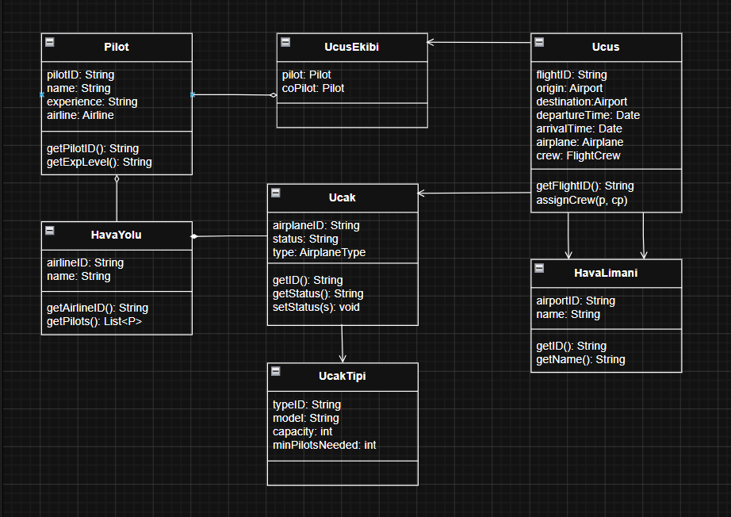

# Hava Yolu Yönetim Sistemi - Sınıf Diyagramı

Bu ödevde, uçuşların, uçakların, havaalanlarının ve pilotların yönetimini kapsayan kapsamlı bir hava yolu yönetim sistemi sınıf diyagramı tasarlanmıştır.

## Ödev İçeriği

Sistem tasarımında aşağıdaki gereksinimler dikkate alınmıştır:

1. **Hava Yolu Şirketleri**: Her şirketin kendine ait bir kimliği (ID) vardır ve uçuşları gerçekleştirirler.
2. **Uçaklar**: Şirketler farklı tipte uçaklara sahiptir. Uçaklar "çalışır" veya "onarımda" durumunda olabilir.
3. **Havaalanları**: Her havaalanının benzersiz bir ID'si ve ismi bulunur.
4. **Uçuşlar**: Her uçuşun benzersiz bir ID'si, kalkış/varış havaalanları ve saat bilgileri vardır.
5. **Personel**: Her uçuşta bir pilot ve bir yardımcı pilot görev alır. Pilotların deneyim seviyeleri kaydedilir.
6. **Kısıtlamalar**: Uçak tiplerine göre gerekli pilot sayısı değişiklik gösterebilir.

## Sınıf Diyagramı

