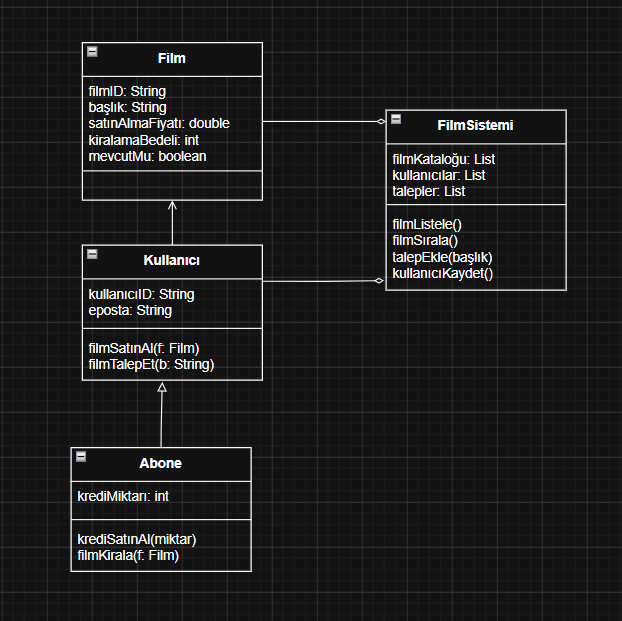

# Online Film Sistemi - Sınıf Diyagramı

Bu ödevde, film kiralama ve satın alma işlemlerini yöneten, abonelik ve kredi tabanlı bir online film sistemi sınıf diyagramı tasarlanmıştır.

## Ödev İçeriği

Sistem tasarımında aşağıdaki fonksiyonel gereksinimler ele alınmıştır:

1. **Film Listeleme**: Filmler listelenebilir ve çeşitli kriterlere göre sıralanabilir.
2. **Abonelik Sistemi**: Kullanıcılar sisteme abone olabilir. Abonelik için sistem üzerinden kredi satın alınması gerekir.
3. **Kiralama**: Sadece abone olan kullanıcılar kredileriyle film kiralayabilir. Kiralama bedeli kredi bakiyesinden düşülür.
4. **Satın Alma**: Hem normal kullanıcılar hem de aboneler doğrudan film satın alabilirler.
5. **Talep Yönetimi**: Eğer bir film sistemde mevcut değilse, kullanıcılar tarafından talep edilebilir.

## Sınıf Diyagramı

