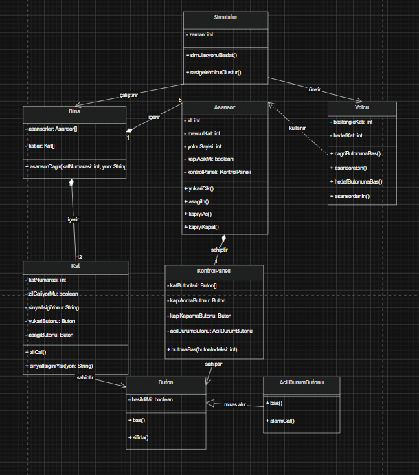

# Asansör Simülasyon Sistemi - Sınıf Diyagramı

Bu ödevde, 12 katlı bir ofis binasında hizmet veren beş asansörün çalışma mantığını modelleyen karmaşık bir simülasyon sisteminin sınıf diyagramı tasarlanmıştır.

## Ödev İçeriği

Sistem tasarımında OOP ilkeleri (Encapsulation, Inheritance, Polymorphism, Abstraction) kullanılarak aşağıdaki gereksinimler ele alınmıştır:

1. **Bina Yapısı**: 12 katlı bir bina ve her kata çıkabilen 5 asansör.
2. **Kapasite ve Verimlilik**: Her asansör 6 yetişkin kapasitelidir ve enerji tasarrufu için yalnızca ihtiyaç halinde hareket eder.
3. **Kontrol Paneli**: Hedef düğmeleri, kapı kontrolü ve acil durum sinyali içeren bir panel.
4. **Kat Donanımları**: Her katta varış zili, yön gösterge ışıkları ve çağrı düğmeleri (yukarı/aşağı).
5. **Programlayıcı (Scheduler)**: Gelen çağrıları en uygun asansöre yönlendiren merkezi bir kontrol mekanizması.
6. **Simülasyon Bileşenleri**:
   - **Saat (Clock)**: Olayları zaman damgasıyla kaydetmek için kullanılır.
   - **Rastgele Yolcu Üretici**: Yolcu varış ve hedef katlarını rastgele belirler.

## Sınıf Diyagramı

